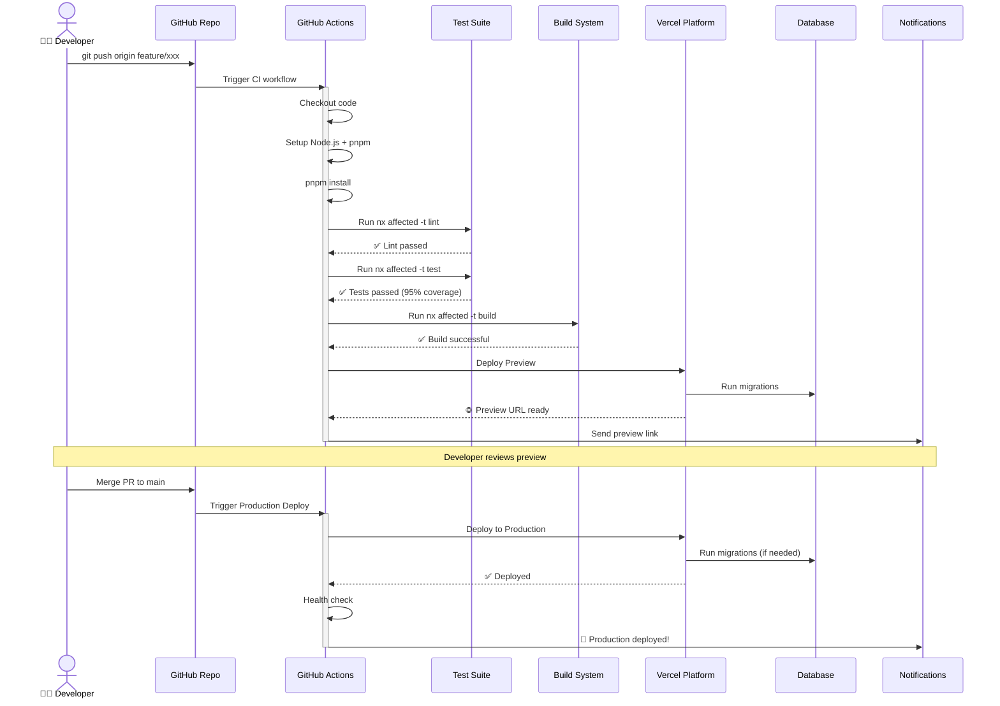
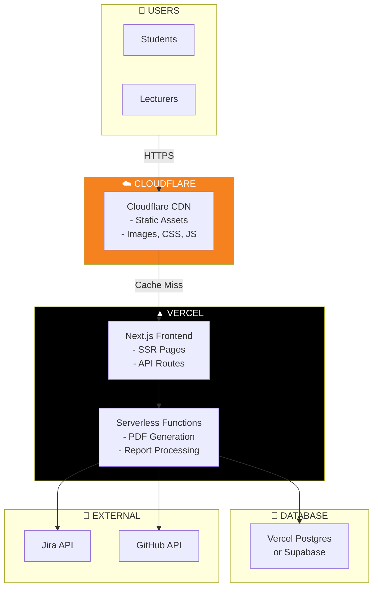

# 🚀 CI/CD PIPELINE & DEPLOYMENT STRATEGY

## 📊 CI/CD PIPELINE DIAGRAM

```mermaid
graph TB
    subgraph Developer["👨‍💻 DEVELOPER WORKFLOW"]
        DevLocal["Local Development<br/>- nx serve<br/>- nx test<br/>- nx lint"]
        GitCommit["Git Commit<br/>- Conventional Commits<br/>- Husky pre-commit"]
        PullRequest["Create Pull Request<br/>- Feature branch → main"]
    end

    subgraph GitHub["🐙 GITHUB ACTIONS"]
        Trigger["🔔 Trigger Events<br/>- push<br/>- pull_request<br/>- release"]

        subgraph CIStage["✅ CI STAGE"]
            Checkout["Checkout Code<br/>actions/checkout@v4"]
            Setup["Setup Environment<br/>- Node.js 20.x<br/>- pnpm 9.x"]
            InstallDeps["Install Dependencies<br/>pnpm install --frozen-lockfile"]

            subgraph Checks["🔍 Quality Checks"]
                Lint["Lint Check<br/>nx affected -t lint"]
                Test["Unit Tests<br/>nx affected -t test"]
                TypeCheck["Type Check<br/>nx run-many -t typecheck"]
                Build["Build Check<br/>nx affected -t build"]
            end
        end

        subgraph CDStage["🚀 CD STAGE"]
            Decision{"Branch?"}

            subgraph Staging["🧪 STAGING DEPLOY"]
                BuildStaging["Build for Staging<br/>NODE_ENV=staging"]
                DeployStaging["Deploy to Staging<br/>- Preview URL<br/>- E2E Tests"]
            end

            subgraph Production["🏭 PRODUCTION DEPLOY"]
                BuildProd["Build for Production<br/>NODE_ENV=production"]
                DeployProd["Deploy to Production<br/>- Zero Downtime<br/>- Rollback Ready"]
                TagRelease["Tag Release<br/>- Semantic Version<br/>- Changelog"]
            end
        end
    end

    subgraph Monitoring["📊 POST-DEPLOYMENT"]
        HealthCheck["Health Check<br/>- API Status<br/>- Database Connection"]
        Notify["Notifications<br/>- Slack/Discord<br/>- Email"]
        Rollback{"Success?"}
    end

    %% Flow
    DevLocal --> GitCommit
    GitCommit --> PullRequest
    PullRequest --> Trigger

    Trigger --> Checkout
    Checkout --> Setup
    Setup --> InstallDeps
    InstallDeps --> Lint
    Lint --> Test
    Test --> TypeCheck
    TypeCheck --> Build

    Build --> Decision
    Decision -->|"PR/dev branch"| BuildStaging
    Decision -->|"main branch"| BuildProd

    BuildStaging --> DeployStaging
    BuildProd --> DeployProd
    DeployProd --> TagRelease

    DeployStaging --> HealthCheck
    TagRelease --> HealthCheck

    HealthCheck --> Rollback
    Rollback -->|"❌ Failed"| Notify
    Rollback -->|"✅ Success"| Notify

    style Developer fill:#E3F2FD
    style GitHub fill:#24292e,color:#fff
    style Monitoring fill:#E8F5E9
    style CIStage fill:#FFF3E0
    style CDStage fill:#F3E5F5
```



---

## 🔄 DETAILED CI/CD WORKFLOW



---

## ☁️ DEPLOYMENT COMPARISON: VERCEL vs CLOUDFLARE

### 📊 **Quick Comparison Table**

| Tiêu chí              | 🟢 Vercel                | 🟠 Cloudflare Pages    |
| --------------------- | ------------------------ | ---------------------- |
| **Next.js Support**   | ⭐⭐⭐⭐⭐ Native        | ⭐⭐⭐⭐ Tốt (adapter) |
| **Server Functions**  | ⭐⭐⭐⭐⭐ Full support  | ⭐⭐⭐ Workers only    |
| **Database**          | ⭐⭐⭐⭐ Vercel Postgres | ⭐⭐⭐ D1 (SQLite)     |
| **Edge Network**      | ⭐⭐⭐⭐ ~100 regions    | ⭐⭐⭐⭐⭐ ~330 cities |
| **Build Time**        | ⭐⭐⭐⭐ Fast            | ⭐⭐⭐⭐⭐ Very fast   |
| **Free Tier**         | 100GB bandwidth          | Unlimited bandwidth    |
| **Pricing**           | $$$ Đắt hơn              | $$ Rẻ hơn              |
| **DX (Developer UX)** | ⭐⭐⭐⭐⭐ Xuất sắc      | ⭐⭐⭐⭐ Tốt           |
| **Preview Deploys**   | ⭐⭐⭐⭐⭐ Automatic     | ⭐⭐⭐⭐⭐ Automatic   |
| **Environment Vars**  | ⭐⭐⭐⭐⭐ Easy          | ⭐⭐⭐⭐ Good          |

---

## 🎯 **PHÂN TÍCH NGHIỆP VỤ DỰ ÁN JIRA-GITHUB MANAGER**

### **Đặc điểm dự án:**

1. **Frontend:** Next.js 16 với App Router
2. **Features chính:**
   - ✅ Generate PDF/Word documents (CPU-intensive)
   - ✅ API proxy to Jira + GitHub
   - ✅ Real-time data aggregation
   - ✅ Database caching (PostgreSQL)
3. **User base:** Sinh viên + Giảng viên FPT (Việt Nam)
4. **Traffic pattern:** Burst traffic (deadline periods)

---

### 🏆 **KHUYẾN NGHỊ: VERCEL (RECOMMENDED)**

#### ✅ **Lý do chọn Vercel:**

1. **Native Next.js Support** ⭐⭐⭐⭐⭐

   ```bash
   # Deploy đơn giản nhất
   vercel deploy
   # Không cần config adapter như Cloudflare
   ```

2. **Server Functions hoạt động tốt**
   - Generate PDF/Word cần Node.js runtime đầy đủ
   - Cloudflare Workers bị giới hạn (50ms CPU time)
   - Vercel Functions: 10s timeout (Hobby), 60s (Pro)

3. **PostgreSQL Integration**

   ```typescript
   // Vercel Postgres - managed, auto-scaling
   import { db } from '@vercel/postgres';

   // vs Cloudflare D1 (SQLite only)
   ```

4. **Developer Experience**
   - Preview deployments tự động cho mỗi PR
   - Environment variables dễ quản lý
   - Built-in analytics
   - Zero configuration

5. **User Location**
   - FPT University có nhiều campus ở VN
   - Vercel có edge network tốt ở châu Á
   - Latency < 100ms từ Việt Nam

#### ⚠️ **Điểm cần lưu ý với Vercel:**

- **Pricing:** Free tier có giới hạn
  - 100GB bandwidth/month
  - 100 GB-hours serverless function execution
  - Đủ cho dự án sinh viên, nhưng cần monitor

- **Vendor lock-in:** Khó migrate sang platform khác

---

### 🟠 **KHI NÀO DÙNG CLOUDFLARE?**

Cloudflare Pages tốt hơn **NẾU:**

1. ✅ Dự án **chủ yếu static** (blog, landing page)
2. ✅ Cần **unlimited bandwidth** (traffic cao)
3. ✅ Không dùng PostgreSQL (dùng D1 SQLite hoặc external DB)
4. ✅ Functions đơn giản, không cần CPU-intensive tasks

**Không phù hợp** cho Jira-GitHub Manager vì:

- ❌ Generate PDF cần processing power
- ❌ D1 (SQLite) không mạnh bằng PostgreSQL
- ❌ Worker timeout = 50ms CPU time (quá ngắn)

---

## 🎨 **HYBRID APPROACH (RECOMMENDED FOR SCALE)**



**Best of both worlds:**

1. Deploy frontend to **Vercel**
2. Use **Cloudflare** as CDN (automatic caching)
3. Static assets cached at edge (300+ locations)
4. Dynamic content from Vercel Functions

---

## 📋 **GITHUB ACTIONS WORKFLOW FILE**

```yaml
# .github/workflows/ci-cd.yml
name: CI/CD Pipeline

on:
  push:
    branches: [main, develop]
  pull_request:
    branches: [main]

env:
  NODE_VERSION: '20.x'
  PNPM_VERSION: '9'

jobs:
  # ===== CI STAGE =====
  quality-checks:
    name: 🔍 Quality Checks
    runs-on: ubuntu-latest

    steps:
      - name: 📥 Checkout code
        uses: actions/checkout@v4
        with:
          fetch-depth: 0 # For nx affected

      - name: 🔧 Setup pnpm
        uses: pnpm/action-setup@v2
        with:
          version: ${{ env.PNPM_VERSION }}

      - name: 🔧 Setup Node.js
        uses: actions/setup-node@v4
        with:
          node-version: ${{ env.NODE_VERSION }}
          cache: 'pnpm'

      - name: 📦 Install dependencies
        run: pnpm install --frozen-lockfile

      - name: 🎨 Lint
        run: pnpm nx affected -t lint --base=origin/main

      - name: 🧪 Test
        run: pnpm nx affected -t test --base=origin/main --coverage

      - name: 📊 Upload coverage
        uses: codecov/codecov-action@v3
        with:
          file: ./coverage/lcov.info

      - name: 🏗️ Build
        run: pnpm nx affected -t build --base=origin/main

  # ===== CD STAGE - STAGING =====
  deploy-staging:
    name: 🧪 Deploy to Staging
    runs-on: ubuntu-latest
    needs: quality-checks
    if: github.event_name == 'pull_request'

    steps:
      - name: 📥 Checkout
        uses: actions/checkout@v4

      - name: 🚀 Deploy to Vercel (Preview)
        uses: amondnet/vercel-action@v25
        with:
          vercel-token: ${{ secrets.VERCEL_TOKEN }}
          vercel-org-id: ${{ secrets.VERCEL_ORG_ID }}
          vercel-project-id: ${{ secrets.VERCEL_PROJECT_ID }}
          scope: ${{ secrets.VERCEL_ORG_ID }}

      - name: 💬 Comment Preview URL
        uses: actions/github-script@v7
        with:
          script: |
            github.rest.issues.createComment({
              issue_number: context.issue.number,
              owner: context.repo.owner,
              repo: context.repo.repo,
              body: '🚀 Preview deployed! Check it out at: ${{ steps.deploy.outputs.preview-url }}'
            })

  # ===== CD STAGE - PRODUCTION =====
  deploy-production:
    name: 🏭 Deploy to Production
    runs-on: ubuntu-latest
    needs: quality-checks
    if: github.ref == 'refs/heads/main' && github.event_name == 'push'

    steps:
      - name: 📥 Checkout
        uses: actions/checkout@v4

      - name: 🚀 Deploy to Vercel (Production)
        uses: amondnet/vercel-action@v25
        with:
          vercel-token: ${{ secrets.VERCEL_TOKEN }}
          vercel-org-id: ${{ secrets.VERCEL_ORG_ID }}
          vercel-project-id: ${{ secrets.VERCEL_PROJECT_ID }}
          vercel-args: '--prod'
          scope: ${{ secrets.VERCEL_ORG_ID }}

      - name: 🏥 Health Check
        run: |
          sleep 10
          curl -f https://jira-github-manager.vercel.app/api/health || exit 1

      - name: 📢 Notify Slack
        uses: slackapi/slack-github-action@v1
        with:
          payload: |
            {
              "text": "🎉 Production deployed successfully!",
              "blocks": [
                {
                  "type": "section",
                  "text": {
                    "type": "mrkdwn",
                    "text": "*Production Deployment* ✅\n*URL:* https://jira-github-manager.vercel.app"
                  }
                }
              ]
            }
        env:
          SLACK_WEBHOOK_URL: ${{ secrets.SLACK_WEBHOOK_URL }}
```

---

## 🎯 **FINAL RECOMMENDATION**

### **For Jira-GitHub Manager Project:**

```
🏆 WINNER: VERCEL

Deployment Strategy:
├── Frontend: Vercel (Next.js)
├── Database: Vercel Postgres or Supabase
├── CDN: Cloudflare (automatic via DNS)
└── Monitoring: Vercel Analytics + Sentry
```

### **Pricing Estimate (Student Project):**

| Service   | Plan             | Cost            |
| --------- | ---------------- | --------------- |
| Vercel    | Hobby (Free)     | $0/month        |
| Database  | Supabase Free    | $0/month        |
| Sentry    | Developer (Free) | $0/month        |
| **Total** |                  | **$0/month** ✅ |

### **When to upgrade:**

- **Vercel Pro** ($20/mo) nếu:
  - Bandwidth > 100GB/month
  - Cần team collaboration
  - Cần priority support

---

## ✅ **SETUP CHECKLIST**

- [ ] Create Vercel account
- [ ] Connect GitHub repository
- [ ] Setup environment variables
- [ ] Configure domain (optional)
- [ ] Setup database (Vercel Postgres/Supabase)
- [ ] Create GitHub Actions workflow
- [ ] Setup branch protection rules
- [ ] Configure Slack notifications
- [ ] Setup error tracking (Sentry)
- [ ] Enable preview deployments

---

**Bạn muốn tôi tạo file config chi tiết cho Vercel deployment không?** 🚀
