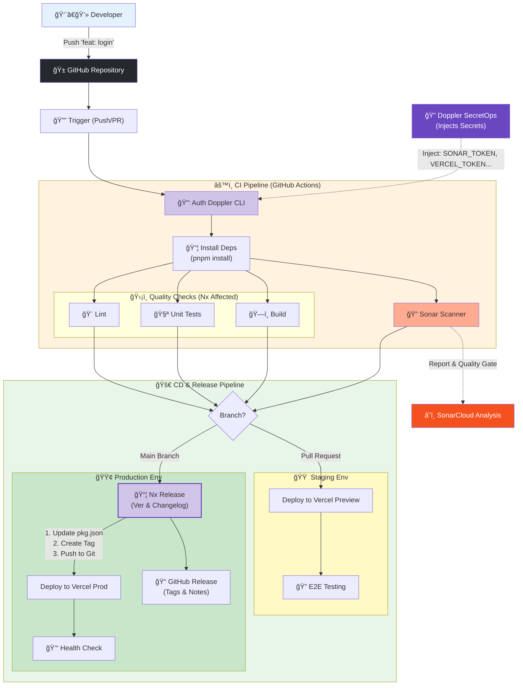
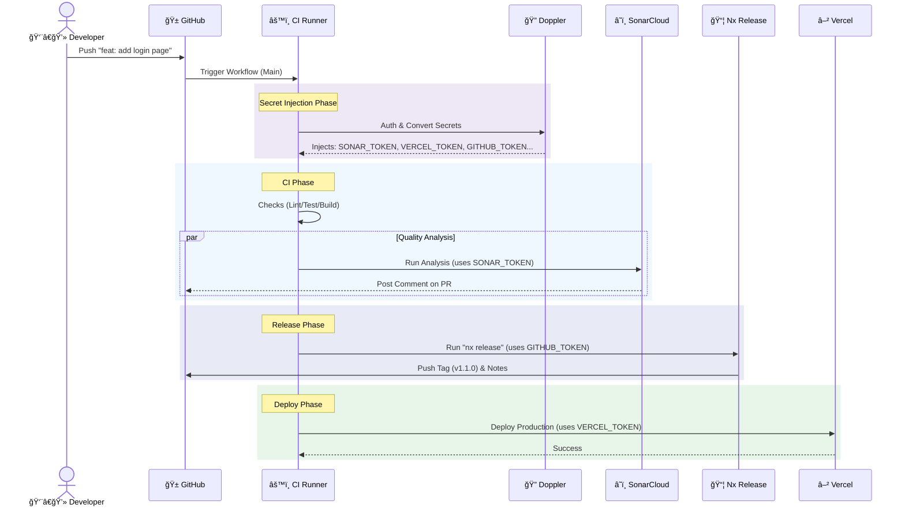

# 🚀 CI/CD PIPELINE DIAGRAM (WITH DOPPLER, SONARCLOUD & NX RELEASE)

```mermaid
graph TB
    %% Definitions of Actors and Systems
    Dev["👨â€ğŸ’» Developer"]
    GitHub["🱠GitHub Repository"]
    Start["🔔 Trigger (Push/PR)"]
    SonarCloud["â˜ï¸ SonarCloud Analysis"]
    Doppler["🔠Doppler SecretOps<br/>(Injects Secrets)"]

    subgraph CI["âš™ï¸ CI Pipeline (GitHub Actions)"]
        LoadSecrets["🔑 Auth Doppler CLI"]
        Install["📦 Install Deps<br/>(pnpm install)"]

        subgraph Checks["ğŸ›¡ï¸ Quality Checks (Nx Affected)"]
            Lint["🨠Lint"]
            Test["🧪 Unit Tests"]
            Build["ğŸ—ï¸ Build"]
        end

        SonarScan["🔠Sonar Scanner"]
    end

    subgraph CD["🚀 CD & Release Pipeline"]
        condition{"Branch?"}

        subgraph Staging["🟠 Staging Env"]
            DeployPreview["Deploy to Vercel Preview"]
            E2ETest["🔠E2E Testing"]
        end

        subgraph Prod["🟢 Production Env"]
            NxRelease["📦 Nx Release<br/>(Ver & Changelog)"]
            DeployProd["Deploy to Vercel Prod"]
            GitHubRelease["📠GitHub Release<br/>(Tags & Notes)"]
            HealthCheck["💓 Health Check"]
        end
    end

    %% Workflow Connections
    Dev -->|"Push 'feat: login'"| GitHub
    GitHub --> Start
    Start --> LoadSecrets
    Doppler -.->|"Inject: SONAR_TOKEN, VERCEL_TOKEN..."| LoadSecrets

    LoadSecrets --> Install
    Install --> Lint & Test & Build

    %% Sonar Integration
    Install --> SonarScan
    SonarScan -.->|"Report & Quality Gate"| SonarCloud

    Lint --> condition
    Test --> condition
    Build --> condition
    SonarScan --> condition

    condition -->|"Pull Request"| DeployPreview
    DeployPreview --> E2ETest

    condition -->|"Main Branch"| NxRelease
    NxRelease -->|"1. Update pkg.json<br/>2. Create Tag<br/>3. Push to Git"| DeployProd
    NxRelease --> GitHubRelease
    DeployProd --> HealthCheck

    %% Styling
    style Dev fill:#E3F2FD
    style GitHub fill:#24292e,color:#fff
    style CI fill:#FFF3E0
    style CD fill:#E8F5E9
    style Staging fill:#FFF9C4
    style Prod fill:#C8E6C9
    style NxRelease fill:#d1c4e9,stroke:#673ab7,stroke-width:2px
    style SonarCloud fill:#F4511E,color:#fff
    style SonarScan fill:#FFAB91
    style Doppler fill:#6B46C1,color:#fff
    style LoadSecrets fill:#D1C4E9
```

## 📠Sequence Diagram (Detailed Flow)

```mermaid
sequenceDiagram
    actor User as 👨â€ğŸ’» Developer
    participant GH as 🱠GitHub
    participant CI as âš™ï¸ CI Runner
    participant Doppler as 🔠Doppler
    participant Sonar as â˜ï¸ SonarCloud
    participant Nx as 📦 Nx Release
    participant Vercel as â–² Vercel

    User->>GH: Push "feat: add login page"
    GH->>CI: Trigger Workflow (Main)

    rect rgb(237, 231, 246)
        Note over CI: Secret Injection Phase
        CI->>Doppler: Auth & Convert Secrets
        Doppler-->>CI: Injects: SONAR_TOKEN, VERCEL_TOKEN, GITHUB_TOKEN...
    end

    rect rgb(240, 248, 255)
        Note over CI: CI Phase
        CI->>CI: Checks (Lint/Test/Build)
        par Quality Analysis
            CI->>Sonar: Run Analysis (uses SONAR_TOKEN)
            Sonar-->>GH: Post Comment on PR
        end
    end

    rect rgb(232, 234, 246)
        Note over CI: Release Phase
        CI->>Nx: Run "nx release" (uses GITHUB_TOKEN)
        Nx->>GH: Push Tag (v1.1.0) & Notes
    end

    rect rgb(232, 245, 233)
        Note over CI: Deploy Phase
        CI->>Vercel: Deploy Production (uses VERCEL_TOKEN)
        Vercel-->>CI: Success
    end
```
