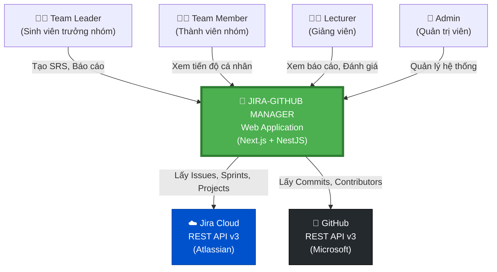
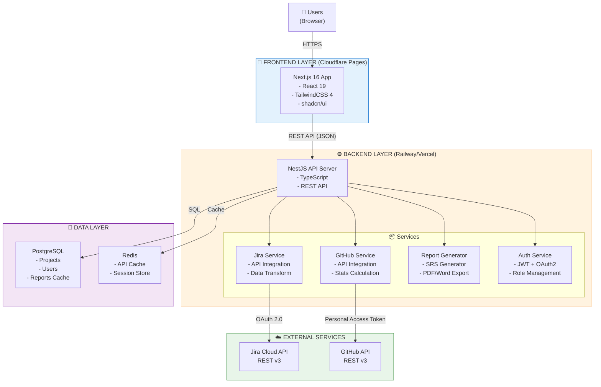
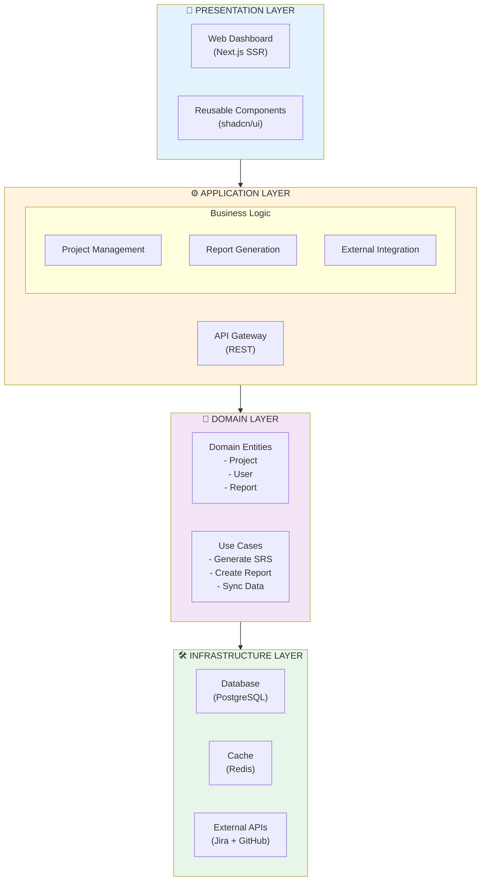
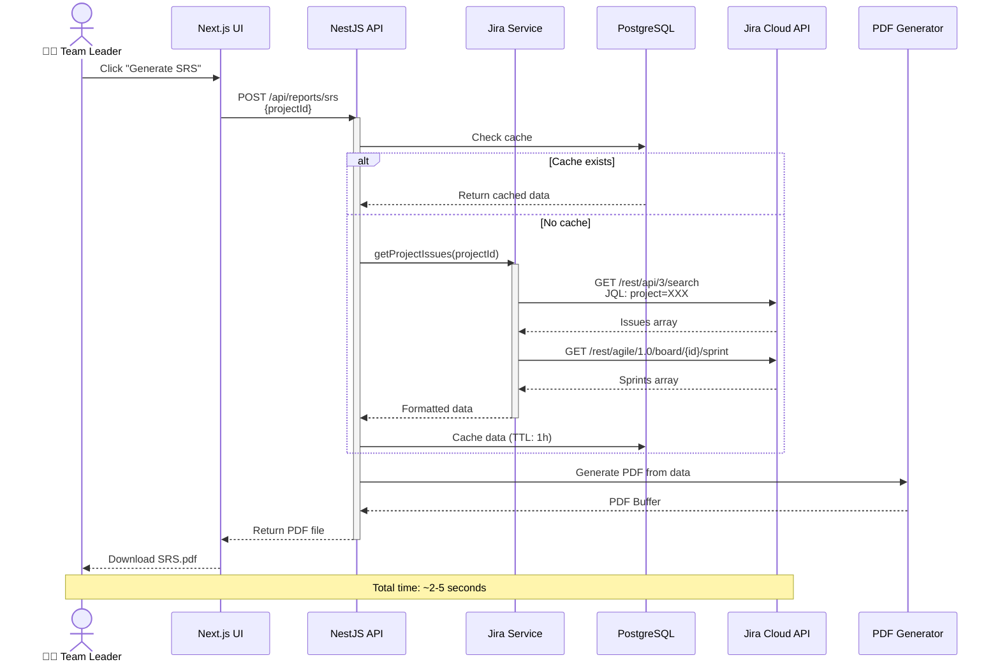
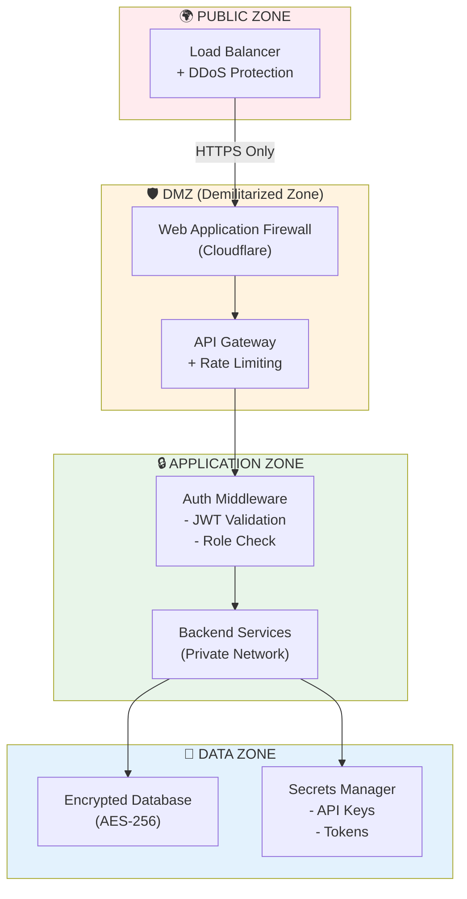
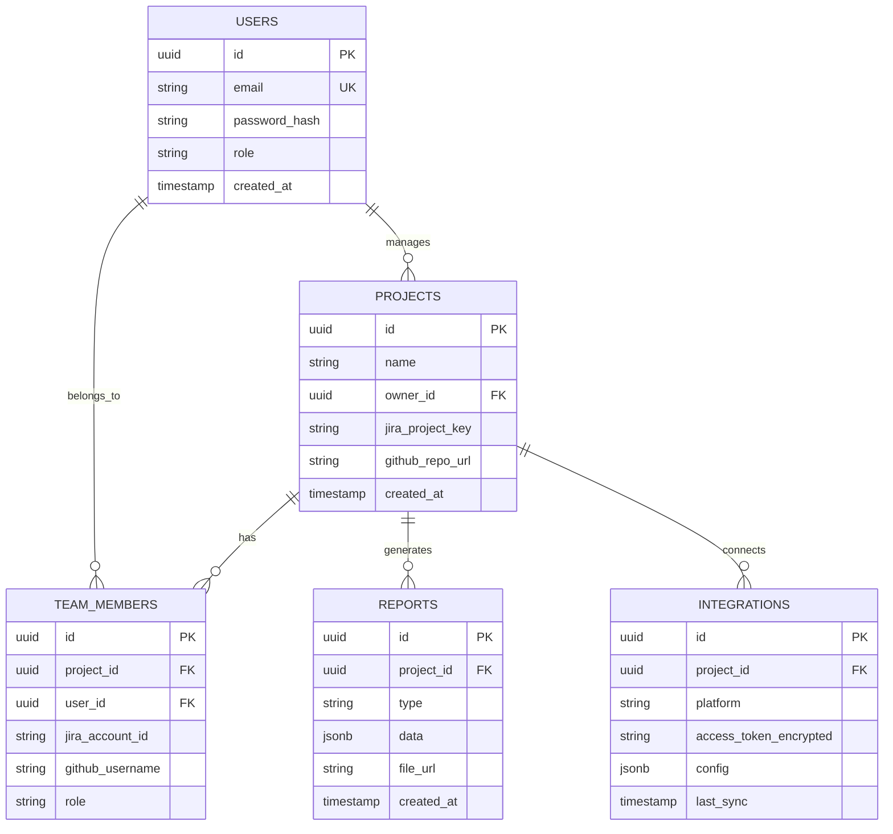
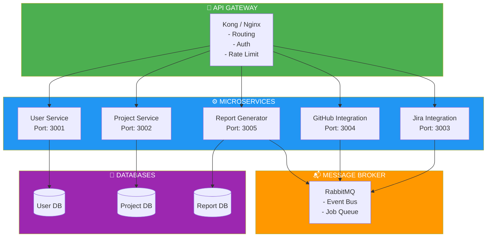

# 🏗️ SYSTEM ARCHITECTURE DIAGRAM - JIRA-GITHUB MANAGER

> **Đánh giá hình ảnh của bạn:**  
> ✅ **Đúng chuẩn SAD!** Hình bạn gửi là một **3-tier architecture** rất chuẩn với:
>
> - **Presentation Layer** (Clients)
> - **Application Layer** (Apps - Microservices)
> - **Data Layer** (Database, Cache, Storage)
> - **External Services** (3rd Party Apps)
>
> Đây là cách thiết kế professional, phù hợp cho các hệ thống production!

---

## 📊 DIAGRAM 1: C4 CONTEXT DIAGRAM (TỔNG QUAN HỆ THỐNG)



---

## 🏛️ DIAGRAM 2: CONTAINER DIAGRAM (KIẾN TRÚC CỤ THỂ)



---

## 🔄 DIAGRAM 3: LAYER ARCHITECTURE (PHÂN TẦNG)



---

## 🚀 DIAGRAM 4: DEPLOYMENT ARCHITECTURE (TRIỂN KHAI)

```mermaid
graph TB
    subgraph Internet["🌐 INTERNET"]
        Users["👥 End Users"]
    end

    subgraph CloudflarePages["☁️ CLOUDFLARE PAGES"]
        FrontendApp["Next.js Application<br/>- Static Assets<br/>- SSR Pages<br/>- Edge Functions"]
        CDN["CDN<br/>(Global Edge Network)"]
    end

    subgraph Railway["🚂 RAILWAY / VERCEL"]
        BackendApp["NestJS API<br/>- Docker Container<br/>- Auto-scaling"]

        subgraph Database["Database Services"]
            PG["PostgreSQL<br/>(Managed)"]
            RD["Redis<br/>(Managed)"]
        end
    end

    subgraph ExternalServices["🔌 EXTERNAL SERVICES"]
        JiraCloud["Jira Cloud<br/>(Atlassian)"]
        GitHubAPI["GitHub API<br/>(Microsoft)"]
    end

    Users -->|"HTTPS/HTTP2"| CDN
    CDN --> FrontendApp
    FrontendApp -->|"API Calls"| BackendApp

    BackendApp --> PG
    BackendApp --> RD
    BackendApp -->|"External API"| JiraCloud
    BackendApp -->|"External API"| GitHubAPI

    style CloudflarePages fill:#F6821F,color:#fff
    style Railway fill:#0B0D0E,color:#fff
    style ExternalServices fill:#E8F5E9
```



---

## 📡 DIAGRAM 5: DATA FLOW DIAGRAM (LUỒNG DỮ LIỆU)

### Use Case: Generate SRS Document



---

## 🔐 DIAGRAM 6: SECURITY ARCHITECTURE



---

## 📊 DIAGRAM 7: DATABASE SCHEMA (ERD)



---

## 🎯 DIAGRAM 8: MICROSERVICES ARCHITECTURE (OPTIONAL - PHASE 2)



---

## 📝 SO SÁNH VỚI HÌNH ẢNH CỦA BẠN

| Tiêu chí        | Hình của bạn               | Thiết kế cho Jira-GitHub Manager   |
| --------------- | -------------------------- | ---------------------------------- |
| **Clients**     | Flutter (Android/iOS/Web)  | Web-only (Next.js)                 |
| **API Gateway** | AWS ELB                    | Cloudflare / Nginx                 |
| **Backend**     | Microservices (Kubernetes) | Monolith → Microservices (phase 2) |
| **Language**    | Python 3.8                 | TypeScript (Node.js)               |
| **Database**    | PostgreSQL                 | PostgreSQL + Redis                 |
| **Caching**     | Redis                      | Redis                              |
| **Storage**     | Amazon S3                  | Amazon S3 (for PDFs)               |
| **IaC**         | Terraform                  | Không có (manual deploy ban đầu)   |
| **Monitoring**  | Prometheus + Grafana       | Sentry (error tracking)            |
| **3rd Party**   | 8+ services                | 2 chính (Jira + GitHub)            |

---

## ✅ KẾT LUẬN VÀ KHUYẾN NGHỊ

### **Đánh giá hình của bạn:**

- ✅ **Rất chuẩn** cho hệ thống production quy mô lớn
- ✅ Có đầy đủ 3 tầng (Clients, Apps, Data)
- ✅ Microservices architecture với Kubernetes
- ✅ Full monitoring stack (Prometheus + Grafana)
- ⚠️ Hơi phức tạp cho một dự án sinh viên

### **Thiết kế cho dự án Jira-GitHub Manager:**

- ✅ **Đơn giản hơn** nhưng vẫn professional
- ✅ Phù hợp với team nhỏ (4-6 người)
- ✅ Dễ deploy và maintain
- ✅ Có thể scale lên microservices sau (Phase 2)

### **Tech Stack Final:**

```
Frontend:  Next.js 16 + TailwindCSS 4
Backend:   NestJS + PostgreSQL + Redis
Deploy:    Cloudflare Pages + Railway
APIs:      Jira Cloud API + GitHub API
```

---

**Bạn thích thiết kế nào? Cần tôi điều chỉnh diagram không?** 🚀
